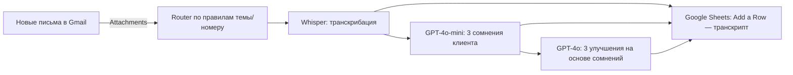
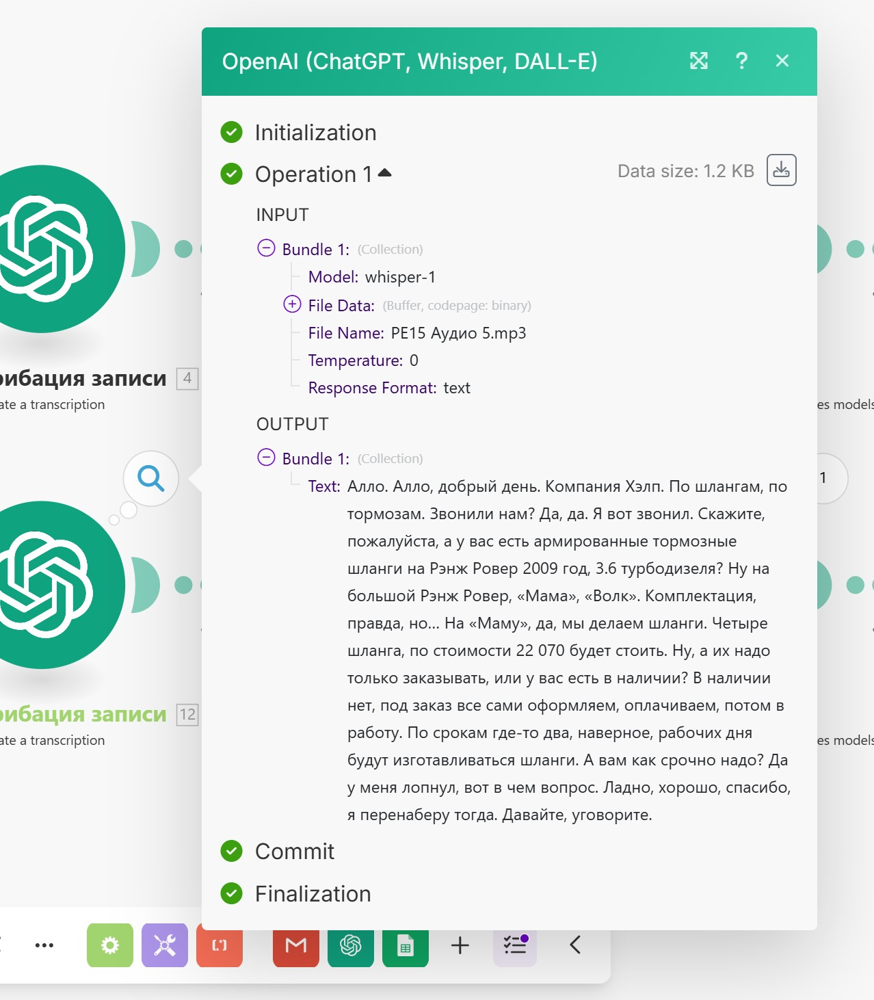

# Автоматический анализ звонков в Make.com (Whisper + GPT‑4o → Google Sheets)


> Готовый сценарий на Make.com, который **получает записи звонков из Gmail**, **транскрибирует аудио в текст (Whisper)**, **выявляет сомнения клиента и генерирует бизнес‑рекомендации (GPT‑4o)** и **сохраняет результаты в Google Sheets** для контроля качества продаж.
---- 
### 🎯 Проблема 
Многие компании, особенно с небольшим штатом или соло-предприниматели, не имеют ресурсов для ручного прослушивания и анализа звонков менеджеров по продажам. Это приводит к потере ценной информации о потребностях и возражениях клиентов. Данный проект решает эту проблему, создавая автоматизированный сервис, который "слушает" звонки и делает на их основе организационные выводы с помощью искусственного интеллекта. 
### 💡 Решение 
Этот проект представляет собой готовый к использованию сценарий в Make.com, который полностью автоматизирует процесс контроля качества: 
* **Собирает** аудиозаписи звонков из электронной почты. 
* **Транскрибирует** речь в текст. 
* **Анализирует** диалог для выявления ключевых моментов (например, сомнений клиента). 
* **Формирует** конкретные рекомендации по улучшению. 
* **Сохраняет** все данные в удобную Google-таблицу для дальнейшего анализа. 
---- 
### 🛠️ Технологический стек 
- **Make.com** — оркестрация сценария (интеграционный конструктор).
- **Gmail** — источник писем с аудио‑вложениями.
- **OpenAI Whisper** — транскрибация аудио → текст.
- **OpenAI GPT‑4o‑mini / GPT‑4o** — анализ сомнений и генерация улучшений.
- **Google Sheets** — хранилище результатов.
- **Flow Control / Router** — маршрутизация по веткам (менеджеры/направления).
--- 
### 🗺️ Визуальная схема процесса 
Ниже представлена общая схема сценария автоматизации, реализованного в Make.com.


---

## 🧭 Схема процесса (mermaid)

> Рекомендации строятся **строго на основе результатов анализа сомнений** (Шаг 4). Дополнительно в таблицу пишется исходный транскрипт.

---


## 🔍 Как это работает — пошагово

### Шаг 1. Получение данных (Gmail)
- **Модуль:** `Gmail > Watch Emails`  
- **Действие:** отслеживает новые письма на указанном адресе, извлекает аудио‑вложения (`Attachments`).  
- **Примечание:** убедитесь, что телефония шлёт записи звонков на этот почтовый ящик.
  


### Шаг 2. Маршрутизация (Router)
- **Модуль:** `Flow Control > Router`  
- **Действие:** делит поток на ветки (напр., по менеджерам).  
- **Фильтр:** по `Subject` (теме письма) — номеру телефона, имени менеджера, тегам и пр.
  


### Шаг 3. Транскрибация (OpenAI Whisper)
- **Модуль:** `OpenAI > Create a Transcription`  
- **Настройки:**  
  - `Response Format: text` (получаем «плоский» текст)  
  - `Temperature: 0` (максимально точная транскрибация без «домыслов»)
    



### Шаг 4. Анализ сомнений клиента (GPT‑4o‑mini)
- **Модуль:** `OpenAI > Create a Chat Completion`  
- **Роль/промпт:** руководитель отдела продаж; по тексту звонка **кратко выделить 3 ключевых сомнения/возражения клиента**.  
- **Настройки:** `Model: gpt‑4o‑mini` (экономно по токенам), `Temperature: 0.5`.
- 


### Шаг 5. Рекомендации по улучшениям (GPT‑4o)
- **Модуль:** `OpenAI > Create a Chat Completion`  
- **Промпт:** по транскрипту **кратко предложить 3 улучшения для повышения продаж**, соотнесённые с сомнениями.  
- **Результат:** конкретные рекомендации (логистика, сроки, цены, сценарии ответов и пр.).
- 


#### **Шаг 6. Сохранение результатов (Google Sheets)** 
- **Модуль:** `Google Sheets > Add a Row` 
- **Данные (колонки):**
  
- Дата звонка. 
- Полная транскрибация разговора. 
- Результат анализа сомнений. 
- Сгенерированные улучшения. 
- Количество потраченных токенов.
  


---
### ✅ Результат 

В итоге мы получаем структурированную базу данных в Google Sheets, где каждый обработанный разговор представлен в удобном для анализа формате. Это позволяет быстро оценивать качество работы менеджеров и выявлять повторяющиеся проблемы для дальнейшей проработки отделом продаж или маркетинга. 

---

## 🚀 Быстрый старт

1) **Клонируйте репозиторий** (или скопируйте README и шаблоны под свой проект).  
2) **Создайте новый сценарий в Make.com** и подключите:
   - Gmail (подключение к ящику, куда приходят записи)
   - OpenAI (добавьте ключ API в «Connections»)
   - Google Sheets (подключите нужный аккаунт/таблицу)
3) **Соберите цепочку модулей** в порядке, описанном выше.  
4) **Создайте Google Sheet** с колонками из раздела «Шаг 6».  
5) **Добавьте фильтры роутера** по теме/номеру/метке письма.  
6) **Запустите сценарий** и отправьте тестовое письмо с аудио-вложением.

> Подсказка: начните с одной ветки роутера (1 менеджер), затем масштабируйте.

---

## 💡 Советы по промптам

**Сомнения (GPT-4o-mini):**
```
Ты — руководитель отдела продаж. По транскрипту звонка кратко выдели ТРИ главных сомнения клиента. Формат: нумерованный список, 1–2 предложения на пункт.
```

**Улучшения (GPT-4o):**
```
По транскрипту и списку сомнений (doubts_top3) предложи ТРИ кратких улучшения. Каждое улучшение явно свяжи с конкретным сомнением.
```

---
---

## 📈 Масштабирование и улучшения
- **Telegram-уведомления:** отправлять краткое резюме анализа после каждого звонка.
- **Глубокий скоринг качества:** вежливость, следование скрипту, слова-паразиты, тайминг пауз.
- **Расширение роутера:** разные отделы, входящие/исходящие, дилерские/розничные заказы.
- **Дедупликация:** защита от повторной обработки одного письма (`source_email_id`).

---

## 💵 Стоимость
Зависит от **длительности аудио (Whisper)** и **объёма токенов (GPT-модели)**. Уточняйте актуальные тарифы в OpenAI и учитывайте возможные лимиты Make.com.

---

## 🧪 Тестирование
- Прогоны на коротких файлах (30–60 сек) для валидации цепочки.
- Сравнение результатов GPT-4o-mini и GPT-4o по качеству/стоимости.
- Спот-проверка вручную 5–10 звонков для настройки фильтров/промптов.

---

