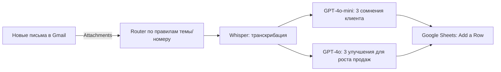

# Автоматический анализ звонков в Make.com (Whisper + GPT‑4o → Google Sheets)

> Готовый сценарий на Make.com, который **получает записи звонков из Gmail**, **транскрибирует аудио в текст (Whisper)**, **выявляет сомнения клиента и генерирует бизнес‑рекомендации (GPT‑4o/4o‑mini)** и **сохраняет результаты в Google Sheets** для контроля качества продаж.

## 📌 Кратко
- **Проблема:** у малого бизнеса нет ресурсов вручную слушать звонки и вынимать инсайты.
- **Решение:** автоматический конвейер «Письмо с записью → Транскрибация → Аналитика сомнений → Рекомендации → Google Sheets».
- **Результат:** единая таблица для аудита качества и быстрых управленческих решений.

---

## 🖼️ Скриншоты сценария Make.com

### Общая схема


### Модуль выявления сомнений


---
## ⚙️ Используемые технологии
- **Make.com** — оркестрация сценария (интеграционный конструктор).
- **Gmail** — источник писем с аудио‑вложениями.
- **OpenAI Whisper** — транскрибация аудио → текст.
- **OpenAI GPT‑4o‑mini / GPT‑4o** — анализ сомнений и генерация улучшений.
- **Google Sheets** — хранилище результатов.
- **Flow Control / Router** — маршрутизация по веткам (менеджеры/направления).

---

## 🧭 Схема процесса (мермайд)

> Ветки роутера можно масштабировать под разных менеджеров, отделы, входящие/исходящие и т.д.

---

## 🔍 Как это работает — пошагово

### Шаг 1. Получение данных (Gmail)
- **Модуль:** `Gmail > Watch Emails`  
- **Действие:** отслеживает новые письма на указанном адресе, извлекает аудио‑вложения (`Attachments`).  
- **Примечание:** убедитесь, что телефония шлёт записи звонков на этот почтовый ящик.

### Шаг 2. Маршрутизация (Router)
- **Модуль:** `Flow Control > Router`  
- **Действие:** делит поток на ветки (напр., по менеджерам).  
- **Фильтр:** по `Subject` (теме письма) — номеру телефона, имени менеджера, тегам и пр.

### Шаг 3. Транскрибация (OpenAI Whisper)
- **Модуль:** `OpenAI > Create a Transcription`  
- **Настройки:**  
  - `Response Format: text` (получаем «плоский» текст)  
  - `Temperature: 0` (максимально точная транскрибация без «домыслов»)  

### Шаг 4. Анализ сомнений клиента (GPT‑4o‑mini)
- **Модуль:** `OpenAI > Create a Chat Completion`  
- **Роль/промпт:** руководитель отдела продаж; по тексту звонка **кратко выделить 3 ключевых сомнения/возражения клиента**.  
- **Настройки:** `Model: gpt‑4o‑mini` (экономно по токенам), `Temperature: 0.5`.

### Шаг 5. Рекомендации по улучшениям (GPT‑4o)
- **Модуль:** `OpenAI > Create a Chat Completion`  
- **Промпт:** по транскрипту **кратко предложить 3 улучшения для повышения продаж**, соотнесённые с сомнениями.  
- **Результат:** конкретные рекомендации (логистика, сроки, цены, сценарии ответов и пр.).

### Шаг 6. Сохранение результатов (Google Sheets)
- **Модуль:** `Google Sheets > Add a Row`  
- **Колонки (пример):**
  - `timestamp` — дата/время звонка
  - `manager` — менеджер/ветка
  - `transcript` — полная транскрибация
  - `doubts_top3` — 3 главных сомнения
  - `improvements_top3` — 3 улучшения
  - `tokens_whisper` / `tokens_gpt_mini` / `tokens_gpt_4o` — счётчики токенов/минут (опционально)
  - `source_email_id` — ID письма (треккинг)

---

## 🗂️ Структура репозитория (рекомендация)
```
.
├─ /blueprints/              # (опц.) экспорт Make Blueprint *.json
├─ /docs/                    # (опц.) скриншоты/диаграммы
├─ README.md                 # этот файл
└─ LICENSE                   # лицензия (например, MIT)
```

---

## 🚀 Быстрый старт

1) **Клонируйте репозиторий** (или скопируйте README и шаблоны под свой проект).  
2) **Создайте новый сценарий в Make.com** и подключите:
   - Gmail (подключение к ящику, куда приходят записи)
   - OpenAI (добавьте ключ API в «Connections»)
   - Google Sheets (подключите нужный аккаунт/таблицу)
3) **Соберите цепочку модулей** в порядке, описанном выше.  
4) **Создайте Google Sheet** с колонками из раздела «Шаг 6».  
5) **Добавьте фильтры роутера** по теме/номеру/метке письма.  
6) **Запустите сценарий** и отправьте тестовое письмо с аудио‑вложением.

> Подсказка: начните с одной ветки роутера (1 менеджер), затем масштабируйте.

---

## 💡 Советы по промптам

**Сомнения (GPT‑4o‑mini):**
```
Ты — руководитель отдела продаж. По транскрипту звонка кратко выдели ТРИ главных сомнения клиента. Формат: нумерованный список, 1–2 предложения на пункт.
```

**Улучшения (GPT‑4o):**
```
По тому же транскрипту предложи ТРИ кратких улучшения, каждое привяжи к конкретному сомнению клиента. Формат: нумерованный список, фокус на действия.
```

---

## 📈 Масштабирование и улучшения
- **Telegram‑уведомления:** отправлять краткое резюме анализа после каждого звонка.
- **Глубокий скоринг качества:** вежливость, следование скрипту, слова‑паразиты, тайминг пауз.
- **Расширение роутера:** разные отделы, входящие/исходящие, дилерские/розничные заказы.
- **Дедупликация:** защита от повторной обработки одного письма (`source_email_id`).

---

## 🔐 Приватность и безопасность
- Храните только необходимые поля, избегайте лишних персональных данных.
- Ограничьте доступ к Google Sheet и к сценарию Make.
- Логируйте минимально достаточные метаданные (ID письма вместо полного тела, если не требуется).
- Проверьте корпоративные требования к хранению аудиозаписей и транскриптов.

---

## 💵 Стоимость
Зависит от **длительности аудио (Whisper)** и **объёма токенов (GPT‑модели)**. Уточняйте актуальные тарифы в OpenAI и учитывайте возможные лимиты Make.com.

---

## 🧰 Troubleshooting (частые вопросы)
- **`Referenced module 'OpenAI (ChatGPT, Whisper, DALL‑E) - Create a transcription' is not accessible`**  
  Проверьте: (1) подключение OpenAI в разделе Connections; (2) права доступа/план в Make; (3) что модуль существует в текущем сценарии/организации.
- **Письмо не ловится Gmail Watch:** убедитесь в правильных критериях (ярлык, папка, «От», «Тема»), проверьте включён ли «Include Attachments» и размер вложений.
- **Пустой транскрипт:** проверьте формат аудио и что Whisper получает файл из `Attachments` (а не ссылку без скачивания).
- **Проблемы с кодировкой/языком:** добавьте в промпт подсказку про ожидаемый язык ответа, если нужно (например, «ответ на русском»).

---

## 🧪 Тестирование
- Прогоны на коротких файлах (30–60 сек) для валидации цепочки.
- Сравнение результатов GPT‑4o‑mini и GPT‑4o по качеству/стоимости.
- Спот‑проверка вручную 5–10 звонков для настройки фильтров/промптов.

---

## 📜 Лицензия
MIT — делайте форк, дорабатывайте, используйте в своих проектах.

---

## 🙌 Благодарности
- Команде, внедряющей контроль качества звонков.
- Сообществу Make.com за идеи сценариев и шаблоны.

---

## 🗣️ Обратная связь
Пишите ишью/PR с предложениями по улучшению, делитесь кейсами и метриками — это поможет развивать решение.

